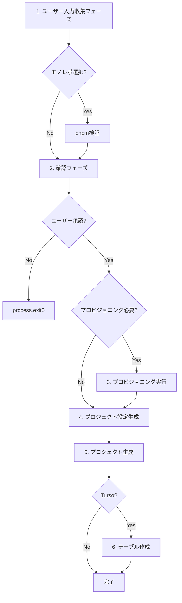

# `pnpm dev new` 処理プロセス詳細分析

> **目的**: ソースコードリーディングによる詳細なバグ抽出と修正のための技術資料
> **対象コマンド**: `pnpm dev new`
> **最終更新**: 2025-01-16
> **バージョン**: 0.5.10

---

## 目次

1. [概要](#概要)
2. [コマンド実行フロー全体図](#コマンド実行フロー全体図)
3. [フェーズ別詳細解析](#フェーズ別詳細解析)
4. [モジュール依存関係](#モジュール依存関係)
5. [データフロー](#データフロー)
6. [潜在的なバグとエッジケース](#潜在的なバグとエッジケース)
7. [修正推奨事項](#修正推奨事項)
8. [コード品質改善ポイント](#コード品質改善ポイント)

---

## 概要

### コマンドの役割

`pnpm dev new` は `fluorite-flake` CLIツールのプロジェクト生成コマンドです。
- **エイリアス**: `create` コマンドと同等の機能を提供
- **目的**: Next.js、Expo、Tauriプロジェクトのボイラープレート生成
- **特徴**: monorepo構造、データベースプロビジョニング、Vercel統合をサポート

### エントリーポイント

```
package.json → dev script → tsx → src/cli.ts → runMain(main)
```

**実行コマンド**:
```bash
pnpm dev  # NODE_ENV=development tsx src/cli.ts
```

---

## コマンド実行フロー全体図

### レベル1: CLIルーティング

```
[ユーザー入力]
     ↓
pnpm dev new <args>
     ↓
src/cli.ts (main command)
     ↓
defineCommand.subCommands.new
     ↓
src/commands/create/commands/new-command.ts
```

### レベル2: 処理フェーズ

`new-command.ts` の `run()` 関数が以下の順序で実行されます:



---

## フェーズ別詳細解析

### フェーズ 1: ユーザー入力収集 (副作用なし)

**担当モジュール**: `src/commands/create/commands/collect-user-inputs.ts`

**処理フロー**:

```typescript
// 1. プロジェクト名の取得
projectName = args.name || await promptForProjectName();

// 2. モノレポフラグの解析
hasExplicitMonorepo = hasExplicitMonorepoFlag(rawArgs);

// 3. プロジェクトタイプとテンプレートの決定
{ projectType, template, monorepoPreference } =
  await determineProjectTypeAndTemplate(args, hasExplicitMonorepo);

// 4. データベースとBlob設定の収集
{ database, databaseConfig, blobConfig } =
  await collectDatabaseAndBlobConfiguration(args, template, projectName);

// 5. ドキュメント生成の確認
shouldGenerateDocs = await promptForDocsGeneration();

// 6. Vercel連携の確認 (Next.jsのみ)
if (projectType === "nextjs") {
  shouldLinkVercel = await confirm(create.vercelLinkConfirm, false);
}

// 7. 最終的なモノレポ設定の決定
finalMonorepoPreference = args.simple ? false : (monorepoPreference ?? args.monorepo ?? true);
```

**入力検証ポイント**:

| 項目 | 検証内容 | 実装箇所 |
|------|---------|---------|
| プロジェクト名 | 必須、特殊文字チェック | `promptForProjectName()` |
| プロジェクトタイプ | 有効な値(nextjs/expo/tauri) | `validateProjectType()` |
| テンプレート | タイプごとの有効なテンプレート | `validateTemplate()` |
| データベース | turso/supabase/sqlite | `validateDatabase()` |

**潜在的な問題**:
- ✅ 入力検証は適切
- ⚠️  `simple` フラグと `monorepo` フラグの競合ケースが複雑
- ⚠️  データベース設定でキャンセル時の `process.exit(0)` が関数内で実行される（呼び出し元で制御できない）

---

### フェーズ 1.5: pnpm検証 (モノレポ選択時のみ)

**担当モジュール**: `src/utils/pnpm-validator/index.ts`

**処理フロー**:

```typescript
if (inputs.monorepoPreference) {
  const pnpmValidation = validatePnpmWithDetails();
  if (!pnpmValidation.isValid) {
    // エラーメッセージ表示 + インストールガイド
    process.exit(1);
  }
  pnpmVersion = pnpmValidation.version;
}
```

**検証内容**:
1. `pnpm --version` の実行可否
2. バージョン番号の抽出
3. 失敗時のインストールガイド表示

**潜在的な問題**:
- ✅ エラーハンドリングは適切
- ℹ️  最小バージョン要件のチェックはなし（将来的に必要になる可能性）

---

### フェーズ 2: 確認フェーズ

**担当モジュール**: `src/commands/create/confirmation/index.ts`

**表示内容**:

```
============================================================
📋 プロジェクト作成設定の確認
============================================================

🏗️  プロジェクト基本情報
   プロジェクト名: my-project
   プロジェクトタイプ: nextjs
   テンプレート: fullstack-admin
   データベース: turso
   モノレポ: 有効
   ドキュメントサイト生成: 有効
   Vercel連携: 有効
   出力ディレクトリ: my-project

============================================================
続行しますか?
```

**ユーザー選択肢**:
- Yes → フェーズ3へ進む
- No → `process.exit(0)` で終了

**潜在的な問題**:
- ✅ 確認内容は十分
- ⚠️  データベース認証情報などの機密情報は表示されていない（セキュリティ的に正しい）

---

### フェーズ 3: プロビジョニング実行 (副作用あり)

**担当モジュール**: `src/commands/create/execution/index.ts`

**実行条件**: `inputs.databaseConfig` が存在する場合のみ

**処理フロー**:

```typescript
if (inputs.databaseConfig) {
  console.log("🚀 プロビジョニングを実行しています...");

  const result = await executeProvisioning(inputs);

  if (!result.success) {
    console.error(`❌ プロビジョニングに失敗しました: ${result.error}`);
    process.exit(1);
  }

  databaseCredentials = result.databaseCredentials;
  database = inputs.databaseConfig.type;
}
```

**プロビジョニング詳細** (`executeProvisioning`):

1. **データベースプロビジョニング**:
   ```typescript
   if (inputs.databaseConfig) {
     if (config.options?.skipProvisioning) {
       // スキップ
     } else {
       const provisioningService = new DatabaseProvisioningService();
       const result = await provisioningService.provision(config);
       // Turso/Supabase APIを呼び出してデータベースを作成
     }
   }
   ```

2. **Blobプロビジョニング** (将来実装):
   ```typescript
   if (inputs.blobConfig) {
     // 現在はプレースホルダートークンを返すのみ
     // 将来的にVercel API呼び出しを実装予定
   }
   ```

**潜在的な問題**:
- ⚠️  **重大**: プロビジョニング失敗時、既に作成されたリソースのクリーンアップがない
  - 例: Tursoでデータベース作成後、Blob設定で失敗した場合、孤立したデータベースが残る
- ⚠️  Blob設定はプレースホルダー実装のため、実際には動作しない
- ℹ️  リトライロジックは `DatabaseProvisioningService` 内に実装されているか要確認

---

### フェーズ 4: プロジェクト設定生成と検証

**担当モジュール**: `src/commands/create/commands/create-and-validate-config.ts`

**処理フロー**:

```typescript
// 1. 基本設定の作成
const config = createProjectConfig(projectType, {
  name: projectName,
  template,
  dir: args.dir,
  force: args.force,
  monorepo: isMonorepoMode,
  database,
});

if (!config) {
  process.exit(1);  // 設定作成失敗
}

// 2. 追加情報の設定
if (databaseConfig) config.databaseConfig = databaseConfig;
if (databaseCredentials) config.databaseCredentials = databaseCredentials;
if (blobConfig) config.blobConfig = blobConfig;
if (pnpmVersion) config.pnpmVersion = pnpmVersion;
if (shouldGenerateDocs !== undefined) config.shouldGenerateDocs = shouldGenerateDocs;

// 3. ディレクトリ上書き確認 (forceフラグがない場合)
if (!config.force) {
  const shouldProceed = await confirmDirectoryOverwrite(config.directory);
  if (!shouldProceed) {
    process.exit(0);  // ユーザーキャンセル
  }
}
```

**`createProjectConfig` 内の処理** (`src/commands/create/config.ts`):

```typescript
// 1. モノレポ利用判定
let willUseMonorepo: boolean;
if (options.simple) {
  willUseMonorepo = false;  // simple指定時は常に無効
} else if (options.monorepo !== undefined) {
  willUseMonorepo = Boolean(options.monorepo);  // 明示的な指定を優先
} else {
  willUseMonorepo = true;  // デフォルトは有効
}

// 2. pnpm検証 (モノレポ利用時)
if (willUseMonorepo) {
  const pnpmValid = validatePnpm();
  if (!pnpmValid) {
    return null;  // pnpm未インストール
  }
}

// 3. プロジェクトタイプとテンプレートの検証
if (!validateProjectType(projectType)) {
  return null;
}
if (!validateTemplate(typedProjectType, template)) {
  return null;
}

// 4. デフォルト値の設定
const projectName = options.name || "my-fluorite-project";
const directory = options.dir || projectName;
const template = options.template || "typescript";

// 5. ProjectConfigオブジェクトを返却
return {
  type, name, directory, template, force, monorepo: willUseMonorepo,
  database, databaseConfig, databaseCredentials, blobConfig,
  pnpmVersion, shouldGenerateDocs,
};
```

**潜在的な問題**:
- ⚠️  **バグ**: `createProjectConfig` 内でpnpm検証が2回実行される
  - 1回目: フェーズ1.5で `validatePnpmWithDetails()`
  - 2回目: ここで `validatePnpm()` ← **不要な重複**
- ⚠️  設定作成失敗時に `null` を返すが、エラーメッセージがユーザーに表示されない
- ℹ️  ディレクトリ上書き確認は `--force` フラグで回避可能（期待通り）

---

### フェーズ 5: プロジェクト生成

**担当モジュール**: `src/commands/create/generator/generate-project.ts`

**全体フロー**:

```typescript
export async function generateProject(config: ProjectConfig): Promise<void> {
  const spinner = ora(...).start();
  let projectCreated = false;
  let templatesCompleted = false;
  let docsCompleted = false;

  try {
    // 1. 事前検証
    const validation = validateProjectGeneration(config);
    if (!validation.valid) {
      throw new Error(`プロジェクト生成の事前検証失敗: ${validation.reason}`);
    }

    // 2. プロジェクトディレクトリ作成
    if (!fs.existsSync(config.directory)) {
      fs.mkdirSync(config.directory, { recursive: true });
      projectCreated = true;
    }

    // 3. テンプレート生成
    const shouldUseAdvancedTemplate = isAdvancedTemplate(config);
    if (shouldUseAdvancedTemplate) {
      await handleAdvancedTemplate(config, spinner);
    } else {
      await handleStandardTemplate(config, spinner);
    }
    templatesCompleted = true;

    // 4. ドキュメント生成
    await handleDocsGeneration(config, spinner);
    docsCompleted = true;

    // 5. ワークスペーススクリプト同期 (monorepoの場合)
    if (config.monorepo) {
      await syncRootScripts(config.directory);
    }

    // 6. Biome設定最適化
    await fixBiomeConfiguration(config.directory);

    // 7. 再インストール (monorepo + docs生成時)
    if (shouldPostInstall(config)) {
      await executePostInstall(config.directory, spinner);
    }

    // 8. 成功メッセージ
    spinner.succeed(...);
    console.log(`📂 プロジェクトの場所: ${projectPath}`);

  } catch (error) {
    spinner.fail(...);

    // エラーログ出力
    console.error(...);

    // 部分的なクリーンアップ
    if (projectCreated && !templatesCompleted) {
      await cleanupFailedProject(config);
    }

    // トラブルシューティングヒント表示
    console.error("💡 トラブルシューティング:");
    // ...

    throw error;  // 呼び出し元へ再送
  }
}
```

**各サブ処理の詳細**:

#### 5-1. 事前検証 (`validateProjectGeneration`)

**検証項目**:
1. ディレクトリ名が空でないか
2. 特殊文字 `<>:"|?*` が含まれていないか
3. 親ディレクトリへの書き込み権限があるか
4. プロジェクト名が空でないか

**潜在的な問題**:
- ✅ 基本的な検証は適切
- ℹ️  パスの長さ制限チェックはなし（Windowsで問題になる可能性）
- ℹ️  ディスク空き容量のチェックはなし

#### 5-2. 拡張テンプレート vs 標準テンプレート

**判定ロジック** (`isAdvancedTemplate`):
```typescript
function isAdvancedTemplate(config: ProjectConfig): boolean {
  const isNextJsAdvanced =
    config.type === "nextjs" && config.template === "fullstack-admin";

  const isExpoAdvanced =
    config.type === "expo" &&
    (config.template === "fullstack-graphql" || config.template === "fullstack-admin");

  const isTauriAdvanced =
    config.type === "tauri" && config.template === "cross-platform";

  return isNextJsAdvanced || isExpoAdvanced || isTauriAdvanced;
}
```

**拡張テンプレート処理** (`handleAdvancedTemplate`):
```typescript
// 1. monorepo構造作成
if (config.monorepo) {
  createMonorepoStructure(config);
  copyMonorepoTemplates(config, config.pnpmVersion);
  // targetDirectory = apps/web
}

// 2. 生成コンテキスト準備
const generationContext = {
  config, useMonorepo, targetDirectory,
  databaseConfig, databaseCredentials, blobConfig,
};

// 3. テンプレートタイプ別のジェネレーター呼び出し
if (config.type === "nextjs") {
  result = await generateFullStackAdmin(generationContext, spinnerController);
} else if (config.type === "expo") {
  if (config.template === "fullstack-graphql") {
    result = await generateExpoGraphQL(generationContext);
  } else if (config.template === "fullstack-admin") {
    result = await generateExpoFullstackAdmin(generationContext);
  }
} else if (config.type === "tauri") {
  result = await generateTauriCrossPlatform(generationContext);
}

// 4. エラーチェック
if (!result.success) {
  throw new Error(`Template generation failed: ${result.errors?.join(", ")}`);
}
```

**標準テンプレート処理** (`handleStandardTemplate`):
```typescript
if (config.monorepo) {
  // monorepo構造作成
  createMonorepoStructure(config);
  copyMonorepoTemplates(config, config.pnpmVersion);
  createWebAppPackageJson(config);
} else {
  // 単一プロジェクトのpackage.json作成
  const packageJsonContent = {
    name: config.name,
    version: "0.1.0",
    description: `A ${config.type} project created with Fluorite Flake`,
    scripts: {
      dev: getDevCommand(config.type),
      build: getBuildCommand(config.type),
    },
    dependencies: {},
    devDependencies: {},
  };
  fs.writeFileSync(packageJsonPath, JSON.stringify(packageJsonContent, null, 2));
}

// README.md作成
const readmeContent = generateReadmeContent(config);
fs.writeFileSync(readmePath, readmeContent);

// .gitignore作成 (Next.jsの場合)
if (config.type === "nextjs") {
  // テンプレートからコピー or フォールバック生成
}

// 依存関係インストールの擬似待機
await new Promise((resolve) => setTimeout(resolve, INSTALL_TIMEOUT_MS));

// テンプレート設定の擬似待機
await new Promise((resolve) => setTimeout(resolve, CONFIGURE_TIMEOUT_MS));
```

**潜在的な問題**:
- ⚠️  **重大**: 標準テンプレートで `dependencies` と `devDependencies` が空オブジェクト
  - 実際の依存関係がインストールされない
  - フレームワーク固有の依存関係が不足
- ⚠️  擬似待機（setTimeout）が使われているが、実際の処理は何もしていない
  - ユーザーに進捗を見せるためのUI演出のみ
- ℹ️  `.gitignore` はNext.jsのみ生成される（他のフレームワークでは生成されない）

#### 5-3. ドキュメント生成 (`handleDocsGeneration`)

**実行条件**: `config.shouldGenerateDocs === true`

**処理フロー**:
```typescript
// 1. 事前検証
const validation = validateDocsDirectory(config);
if (!validation.valid) {
  console.warn(`⚠️ ${validation.reason}`);
  console.warn("ドキュメント生成をスキップします");
  return;  // エラーではなく警告で継続
}

// 2. Nextraテンプレートコピー
const docsTemplateOptions = {
  projectName: config.name,
  outputPath: config.directory,
  isMonorepo: config.monorepo,
  title: `${config.name} Documentation`,
  description: `Documentation for ${config.name}`,
};
templateCopySuccess = await copyDocsTemplate(docsTemplateOptions);

// 3. package.json生成
const packageJsonOptions = {
  projectName: config.name,
  outputPath: config.directory,
  isMonorepo: config.monorepo,
  reactVersion: "^19.1.0",
  nextVersion: "^15.5.4",
  nextraVersion: "^4.6.0",
};
packageJsonSuccess = await createDocsPackageJson(packageJsonOptions);
```

**エラーハンドリング**:
```typescript
catch (error) {
  // 部分的な成功状態のクリーンアップ
  if (fs.existsSync(docsPath)) {
    fs.rmSync(docsPath, { recursive: true, force: true });
  }

  // 警告表示して継続
  console.warn("⚠️ ドキュメント生成中にエラーが発生しました");
  console.warn("プロジェクト生成は継続されますが、ドキュメントは生成されませんでした");

  // 手動追加の案内
  console.warn("💡 後でドキュメントを追加する場合:");
  if (config.monorepo) {
    console.warn("   pnpm create next-app@latest apps/docs --example blog-starter");
  } else {
    console.warn("   pnpm create next-app@latest docs --example blog-starter");
  }
}
```

**潜在的な問題**:
- ✅ エラー時のクリーンアップとユーザーガイドは適切
- ⚠️  ドキュメント生成失敗がログに残らない（デバッグ困難）
- ℹ️  Nextraのバージョンが固定されている（将来的にバージョン管理が必要）

#### 5-4. ワークスペーススクリプト同期 (`syncRootScripts`)

**実行条件**: `config.monorepo === true`

**処理概要**:
```typescript
// apps/* の全パッケージからスクリプトを収集
// ルートpackage.jsonに統合スクリプトを追加
// 例:
// - dev → pnpm -r --parallel dev
// - build → pnpm -r build
// - test → pnpm -r test
```

**潜在的な問題**:
- ℹ️  実装詳細は `workspace-manager` 内
- ℹ️  スクリプト重複時の優先順位が不明

#### 5-5. Biome設定最適化 (`fixBiomeConfiguration`)

**処理フロー**:
```typescript
// 1. 現在のBiomeバージョン取得
const biomeVersion = await getCurrentBiomeVersion();
if (!biomeVersion) return;  // Biomeが無ければスキップ

// 2. すべてのbiome.jsonファイルを検索
const biomeConfigFiles = findBiomeConfigFiles(projectRoot);

// 3. 各ファイルを修正
for (const configFile of biomeConfigFiles) {
  await fixSingleBiomeConfig(configFile, biomeVersion);
}
```

**修正内容** (`fixSingleBiomeConfig`):
```typescript
// 1. スキーマURLを現在のバージョンに更新
config.$schema = `https://biomejs.dev/schemas/${biomeVersion}/schema.json`;

// 2. 廃止されたルールを削除 (Biome 2.2.0基準)
const removedRules = [
  "noDeprecatedImports",
  "noDuplicateDependencies",
  "noReactForwardRef",
  "noUnusedExpressions",
  "noVueDuplicateKeys",
  "useConsistentArrowReturn",
  "noJsxLiterals",
  "noUselessCatchBinding",
  "useVueMultiWordComponentNames",
];

// nurseryセクションから削除
if (config.linter?.rules?.nursery) {
  for (const rule of removedRules) {
    delete config.linter.rules.nursery[rule];
  }
}
```

**潜在的な問題**:
- ✅ エラーハンドリングは適切（失敗してもプロジェクト生成は継続）
- ℹ️  Biomeバージョンの互換性チェックがない
- ℹ️  `node_modules` と `.git` を除外しているが、他の除外対象がない

#### 5-6. 再インストール (`executePostInstall`)

**実行条件**: `shouldPostInstall(config)` が true

```typescript
function shouldPostInstall(config: ProjectConfig): boolean {
  if (!config.monorepo) return false;
  if (!config.shouldGenerateDocs) return false;

  // docsディレクトリが実際に存在するかチェック
  const docsPath = path.join(config.directory, "apps", "docs");
  return fs.existsSync(docsPath);
}
```

**再インストール処理** (リトライロジック付き):
```typescript
async function executePostInstall(projectPath: string, spinner: Ora): Promise<void> {
  const maxRetries = 2;
  let attempt = 0;

  // 事前検証
  const validation = validateProjectStructure(projectPath);
  if (!validation.valid) {
    console.warn(`⚠️ プロジェクト構造の検証失敗: ${validation.reason}`);
    console.warn(create.postInstallFailed);
    return;  // 警告して終了
  }

  while (attempt <= maxRetries) {
    try {
      spinner.text = `${create.spinnerPostInstalling} (${attempt + 1}/${maxRetries + 1}回目)`;

      execSync("pnpm install", {
        cwd: projectPath,
        stdio: isDevelopment() ? "inherit" : "pipe",
        timeout: 120000,  // 2分でタイムアウト
      });

      return;  // 成功時は即座にreturn
    } catch (error) {
      attempt++;

      if (attempt > maxRetries) {
        // 最後の試行でも失敗
        console.warn(chalk.yellow(create.postInstallFailed));
        console.warn(chalk.cyan("💡 手動で依存関係をインストールする場合:"));
        console.warn(chalk.cyan(`   cd ${path.relative(process.cwd(), projectPath)}`));
        console.warn(chalk.cyan("   pnpm install"));
        break;
      }

      // リトライ前に1秒待機
      await new Promise((resolve) => setTimeout(resolve, 1000));
    }
  }
}
```

**潜在的な問題**:
- ✅ リトライロジックとエラーハンドリングは適切
- ✅ タイムアウト設定あり（2分）
- ⚠️  開発モードでは `stdio: "inherit"` でインストールログが全て表示される（意図的？）
- ℹ️  リトライ間隔が固定1秒（exponential backoffではない）

---

### フェーズ 6: Tursoテーブル作成 (Turso利用時のみ)

**担当モジュール**: `src/commands/create/commands/create-turso-tables.ts`

**実行条件**:
```typescript
if (databaseCredentials && database === "turso") {
  console.log("🗄️ Tursoクラウドデータベースにテーブルを作成中...");
  await createTursoTables(config, databaseCredentials);
}
```

**処理内容** (推測):
```typescript
// 1. Turso CLIを使用してテーブル作成SQLを実行
// 2. 初期スキーマの適用
// 3. 認証情報の検証
```

**潜在的な問題**:
- ℹ️  実装詳細を確認する必要あり
- ⚠️  テーブル作成失敗時のエラーハンドリングが不明

---

## モジュール依存関係

### 主要モジュール依存グラフ

```
new-command.ts
  ├─ collect-user-inputs.ts
  │   ├─ determine-project-type-and-template.ts
  │   │   ├─ template-selector/index.ts
  │   │   └─ validators/index.ts
  │   ├─ collect-database-and-blob-configuration.ts
  │   │   ├─ determine-database-selection.ts
  │   │   ├─ database-provisioning/prompts.ts
  │   │   └─ prompts/blob-prompts.ts
  │   └─ user-input/index.ts
  ├─ pnpm-validator/index.ts
  ├─ confirmation/index.ts
  ├─ execution/index.ts
  │   └─ database-provisioning/service.ts
  ├─ create-and-validate-config.ts
  │   └─ config.ts
  ├─ generator/index.ts
  │   └─ generate-project.ts
  │       ├─ handle-advanced-template.ts
  │       ├─ handle-standard-template.ts
  │       ├─ docs-generation.ts
  │       ├─ post-install.ts
  │       └─ biome-configuration.ts
  └─ create-turso-tables.ts
```

### 外部依存関係

| パッケージ | 用途 | バージョン |
|-----------|------|-----------|
| `citty` | CLIフレームワーク | ^0.1.6 |
| `ora` | スピナー表示 | ^8.2.0 |
| `chalk` | CLI出力の彩色 | ^5.6.2 |
| `prompts` | 対話的入力 | ^2.4.2 |
| `fs-extra` | ファイルシステム拡張 | ^11.3.2 |
| `execa` | プロセス実行 | ^9.6.0 |

---

## データフロー

### 主要データ構造

#### ConfirmationInputs

```typescript
type ConfirmationInputs = {
  projectName: string;
  projectType: string;
  template?: string;
  database?: DatabaseType;
  databaseConfig?: DatabaseProvisioningConfig;
  blobConfig?: BlobConfiguration;
  monorepoPreference: boolean;
  outputDirectory?: string;
  shouldGenerateDocs?: boolean;
  shouldLinkVercel?: boolean;
};
```

#### ProjectConfig

```typescript
type ProjectConfig = {
  type: ProjectType;
  name: string;
  directory: string;
  template?: string;
  force: boolean;
  monorepo: boolean;
  database?: DatabaseType;
  databaseConfig?: DatabaseProvisioningConfig;
  databaseCredentials?: DatabaseCredentials;
  blobConfig?: BlobConfiguration;
  pnpmVersion?: string;
  shouldGenerateDocs?: boolean;
};
```

#### ExecutionResult

```typescript
type ExecutionResult = {
  databaseCredentials?: DatabaseCredentials;
  databases?: DatabaseInfo[];
  blobCredentials?: BlobCredentials;
  success: boolean;
  error?: string;
};
```

### データ変換フロー

```
[ユーザー入力 (args + prompts)]
         ↓
[ConfirmationInputs] ← 収集フェーズで作成
         ↓
[ExecutionResult] ← プロビジョニングフェーズで作成
         ↓
[ProjectConfig] ← 設定生成フェーズで統合
         ↓
[プロジェクトファイル] ← 生成フェーズで出力
```

---

## 潜在的なバグとエッジケース

### 🔴 重大 (Critical)

#### 1. プロビジョニング失敗時のリソースリーク

**問題箇所**: `src/commands/create/execution/index.ts:57-94`

**説明**:
- データベースプロビジョニング成功後、Blob設定で失敗した場合
- 既に作成されたデータベースがクリーンアップされない
- 孤立したリソースが残る

**影響**:
- リソースの無駄遣い
- コスト発生（Turso/Supabaseの有料プラン使用時）
- 次回の実行で同じ名前のデータベースが競合する可能性

**修正案**:
```typescript
export async function executeProvisioning(inputs: ConfirmationInputs): Promise<ExecutionResult> {
  const result: ExecutionResult = { success: false };
  const rollbackActions: Array<() => Promise<void>> = [];

  try {
    // データベースプロビジョニング
    if (inputs.databaseConfig) {
      const dbResult = await executeDatabaseProvisioning(inputs.databaseConfig);
      if (!dbResult.success) {
        return { success: false, error: `データベースプロビジョニングに失敗: ${dbResult.error}` };
      }
      result.databaseCredentials = dbResult.credentials;
      result.databases = dbResult.databases;

      // ロールバックアクション登録
      rollbackActions.push(async () => {
        await rollbackDatabaseProvisioning(inputs.databaseConfig!, dbResult.credentials);
      });
    }

    // Blobプロビジョニング
    if (inputs.blobConfig) {
      const blobResult = await executeBlobProvisioning(inputs.blobConfig);
      if (!blobResult.success) {
        // Blob失敗時はデータベースをロールバック
        for (const rollback of rollbackActions.reverse()) {
          await rollback();
        }
        return { success: false, error: `Blobプロビジョニングに失敗: ${blobResult.error}` };
      }
      result.blobCredentials = blobResult.credentials;
    }

    result.success = true;
    return result;
  } catch (error) {
    // エラー時は全てロールバック
    for (const rollback of rollbackActions.reverse()) {
      try {
        await rollback();
      } catch (rollbackError) {
        console.error("ロールバック失敗:", rollbackError);
      }
    }
    return { success: false, error: error instanceof Error ? error.message : String(error) };
  }
}
```

#### 2. pnpm検証の重複実行

**問題箇所**:
- `src/commands/create/commands/new-command.ts:38-45`
- `src/commands/create/config.ts:22-27`

**説明**:
- モノレポ選択時、pnpm検証が2回実行される
- 1回目: `validatePnpmWithDetails()` で詳細情報取得
- 2回目: `createProjectConfig` 内で `validatePnpm()` を再実行

**影響**:
- 処理の無駄
- ユーザー体験の低下（2回同じチェックが走る）

**修正案**:
```typescript
// new-command.ts
let pnpmVersion: string | undefined;
if (inputs.monorepoPreference) {
  const pnpmValidation = validatePnpmWithDetails();
  if (!pnpmValidation.isValid) {
    process.exit(1);
  }
  pnpmVersion = pnpmValidation.version;
}

// config.ts - pnpm検証を削除
export function createProjectConfig(projectType: string, options: CreateOptions): ProjectConfig | null {
  let willUseMonorepo: boolean;
  if (options.simple) {
    willUseMonorepo = false;
  } else if (options.monorepo !== undefined) {
    willUseMonorepo = Boolean(options.monorepo);
  } else {
    willUseMonorepo = true;
  }

  // ❌ この検証は不要 - 呼び出し元で既に実行済み
  // if (willUseMonorepo) {
  //   const pnpmValid = validatePnpm();
  //   if (!pnpmValid) {
  //     return null;
  //   }
  // }

  // ... 以降の処理
}
```

#### 3. 標準テンプレートで依存関係が空

**問題箇所**: `src/commands/create/generator/handle-standard-template.ts:18-34`

**説明**:
- 標準テンプレートで生成される `package.json` の `dependencies` と `devDependencies` が空オブジェクト
- 実際のフレームワーク依存関係が含まれていない

**影響**:
- プロジェクトが動作しない
- ユーザーが手動で依存関係を追加する必要がある

**修正案**:
```typescript
// フレームワーク別の依存関係を定義
const FRAMEWORK_DEPENDENCIES: Record<ProjectType, { dependencies: Record<string, string>, devDependencies: Record<string, string> }> = {
  nextjs: {
    dependencies: {
      "next": "^15.5.4",
      "react": "^19.1.0",
      "react-dom": "^19.1.0",
    },
    devDependencies: {
      "@types/node": "^22.0.0",
      "@types/react": "^19.0.0",
      "@types/react-dom": "^19.0.0",
      "typescript": "^5.9.3",
    },
  },
  expo: {
    dependencies: {
      "expo": "~52.0.0",
      "react": "19.0.0",
      "react-native": "0.76.5",
    },
    devDependencies: {
      "@babel/core": "^7.20.0",
      "@types/react": "~19.0.0",
      "typescript": "^5.9.3",
    },
  },
  tauri: {
    dependencies: {
      "@tauri-apps/api": "^2.0.0",
      "react": "^19.1.0",
      "react-dom": "^19.1.0",
    },
    devDependencies: {
      "@tauri-apps/cli": "^2.0.0",
      "@types/react": "^19.0.0",
      "typescript": "^5.9.3",
      "vite": "^6.0.0",
    },
  },
};

// package.json作成時に使用
const deps = FRAMEWORK_DEPENDENCIES[config.type];
const packageJsonContent = {
  name: config.name,
  version: "0.1.0",
  description: `A ${config.type} project created with Fluorite Flake`,
  scripts: {
    dev: getDevCommand(config.type),
    build: getBuildCommand(config.type),
  },
  dependencies: deps.dependencies,
  devDependencies: deps.devDependencies,
};
```

---

### 🟡 警告 (Warning)

#### 4. データベース設定キャンセル時の強制終了

**問題箇所**: `src/commands/create/commands/collect-database-and-blob-configuration.ts:44-48`

**説明**:
- データベース設定収集時にキャンセルすると `process.exit(0)` が関数内で実行される
- 呼び出し元で制御できない

**影響**:
- テストが困難
- 将来的に異なる動作を実装したい場合に柔軟性がない

**修正案**:
```typescript
// カスタムエラーを投げる
if (error instanceof Error && error.message === "DATABASE_PROVISIONING_CANCELLED") {
  throw new UserCancelledError("データベース設定がキャンセルされました");
}

// 呼び出し元でハンドリング
try {
  const { database, databaseConfig, blobConfig } =
    await collectDatabaseAndBlobConfiguration(args, template, projectName);
} catch (error) {
  if (error instanceof UserCancelledError) {
    console.warn("⚠️ 操作がキャンセルされました");
    process.exit(0);
  }
  throw error;
}
```

#### 5. simpleフラグとmonorepoフラグの複雑な優先順位

**問題箇所**: `src/commands/create/commands/collect-user-inputs.ts:64`

**説明**:
```typescript
const finalMonorepoPreference =
  args.simple ? false : (monorepoPreference ?? args.monorepo ?? true);
```
- 優先順位が複雑で理解しづらい
- ドキュメント化されていない

**影響**:
- ユーザーが意図しない動作になる可能性
- 保守性の低下

**修正案**:
```typescript
/**
 * モノレポ構成の最終決定
 *
 * 優先順位:
 * 1. --simple フラグ → 常にモノレポ無効
 * 2. --monorepo / --no-monorepo 明示フラグ → フラグの値を使用
 * 3. テンプレート選択時のユーザー選択 → 選択値を使用
 * 4. デフォルト → モノレポ有効
 */
function determineFinalMonorepoPreference(
  args: { simple?: boolean; monorepo?: boolean },
  monorepoPreference: boolean | undefined
): boolean {
  // 1. simpleフラグは全てをオーバーライド
  if (args.simple) {
    return false;
  }

  // 2. 明示的なmonorepoフラグ
  if (args.monorepo !== undefined) {
    return Boolean(args.monorepo);
  }

  // 3. テンプレート選択時のユーザー選択
  if (monorepoPreference !== undefined) {
    return monorepoPreference;
  }

  // 4. デフォルトはtrue
  return true;
}

const finalMonorepoPreference =
  determineFinalMonorepoPreference(args, monorepoPreference);
```

#### 6. Blob設定がプレースホルダー実装

**問題箇所**: `src/commands/create/execution/index.ts:150-174`

**説明**:
```typescript
return {
  success: true,
  credentials: {
    token: "placeholder-token",  // ← プレースホルダー
    storeName: config.storeName || "default-store",
  },
};
```
- 実際のVercel API呼び出しが実装されていない
- ユーザーは機能が動作していると誤解する可能性

**影響**:
- ユーザーが期待した機能が動作しない
- デバッグが困難

**修正案**:
```typescript
// 1. 機能が未実装であることを明示
console.warn("⚠️ Vercel Blob設定は現在未実装です");
console.warn("手動でVercelダッシュボードから設定してください");
return {
  success: false,
  error: "Vercel Blob設定は現在未実装です",
};

// OR

// 2. 実装を完成させる
import { VercelClient } from "../../../utils/vercel-cli/index.js";

async function executeBlobProvisioning(config: BlobConfiguration): Promise<{
  success: boolean;
  credentials?: BlobCredentials;
  error?: string;
}> {
  try {
    console.log("📦 Vercel Blob設定を実行中...");

    const vercelClient = new VercelClient(config.token);
    const result = await vercelClient.createBlobStore({
      name: config.storeName,
      region: config.region,
    });

    console.log(`✅ Vercel Blob設定完了: ${config.storeName}`);

    return {
      success: true,
      credentials: {
        token: result.token,
        storeName: result.name,
      },
    };
  } catch (error) {
    return {
      success: false,
      error: error instanceof Error ? error.message : String(error),
    };
  }
}
```

---

### 🔵 情報 (Info)

#### 7. パス長制限のチェックがない

**問題箇所**: `src/commands/create/generator/project-validation.ts:10-31`

**説明**:
- Windowsではパスの最大長が260文字（MAX_PATH）
- 深いネストやmonorepo構造で制限に引っかかる可能性

**影響**:
- Windows環境でプロジェクト生成が失敗する可能性

**修正案**:
```typescript
function validateProjectGeneration(config: ProjectConfig): { valid: boolean; reason?: string } {
  // ... 既存の検証 ...

  // パス長制限チェック (Windows)
  if (process.platform === "win32") {
    const fullPath = path.resolve(config.directory);
    const MAX_PATH = 260;

    // monorepo構造の場合はさらに深くなる可能性を考慮
    const estimatedMaxDepth = config.monorepo ? fullPath.length + 100 : fullPath.length + 50;

    if (estimatedMaxDepth > MAX_PATH) {
      return {
        valid: false,
        reason: `プロジェクトパスが長すぎます（推定: ${estimatedMaxDepth}文字、最大: ${MAX_PATH}文字）。より短いパスを使用してください`,
      };
    }
  }

  return { valid: true };
}
```

#### 8. ディスク空き容量のチェックがない

**問題箇所**: `src/commands/create/generator/project-validation.ts`

**説明**:
- プロジェクト生成前にディスクの空き容量をチェックしていない
- 生成途中で容量不足になる可能性

**影響**:
- 部分的なプロジェクトが残る
- エラーメッセージが分かりにくい

**修正案**:
```typescript
import { statfs } from "node:fs/promises";

async function validateProjectGeneration(config: ProjectConfig): Promise<{ valid: boolean; reason?: string }> {
  // ... 既存の検証 ...

  // ディスク空き容量チェック
  try {
    const parentDir = path.dirname(path.resolve(config.directory));
    const stats = await statfs(parentDir);
    const availableBytes = stats.bavail * stats.bsize;
    const requiredBytes = 500 * 1024 * 1024;  // 最低500MBを要求

    if (availableBytes < requiredBytes) {
      return {
        valid: false,
        reason: `ディスクの空き容量が不足しています（利用可能: ${Math.floor(availableBytes / 1024 / 1024)}MB、必要: ${Math.floor(requiredBytes / 1024 / 1024)}MB）`,
      };
    }
  } catch (error) {
    // 空き容量チェックに失敗しても警告のみ
    console.warn("⚠️ ディスク空き容量のチェックに失敗しました");
  }

  return { valid: true };
}
```

---

## 修正推奨事項

### 優先度: 高 (High Priority)

1. **プロビジョニング失敗時のロールバック実装**
   - リソースリークを防ぐ
   - トランザクション的な動作を保証

2. **pnpm検証の重複削除**
   - 処理効率の向上
   - コードの単純化

3. **標準テンプレートの依存関係追加**
   - 生成されたプロジェクトが即座に動作する
   - ユーザー体験の大幅改善

### 優先度: 中 (Medium Priority)

4. **エラーハンドリングの統一**
   - `process.exit()` を関数内で直接呼ばない
   - エラークラスを投げて呼び出し元でハンドリング

5. **simpleフラグとmonorepoフラグの優先順位を明確化**
   - ドキュメント化
   - 関数として分離

6. **Blob設定の実装完了 or 未実装の明示**
   - プレースホルダーを削除
   - 実装するか、未実装であることを明示

### 優先度: 低 (Low Priority)

7. **パス長制限とディスク容量のチェック追加**
   - エッジケースへの対応
   - より親切なエラーメッセージ

8. **テストカバレッジの向上**
   - エッジケースのテスト追加
   - 統合テストの充実

---

## コード品質改善ポイント

### 1. 型安全性の向上

**現状**:
```typescript
const args: {
  name?: string;
  type?: string;
  template?: string;
  // ...
}
```

**改善案**:
```typescript
// 専用の型定義を作成
type NewCommandArgs = {
  name?: string;
  type?: ProjectType;  // stringではなく厳密な型
  template?: string;
  database?: DatabaseType;
  dir?: string;
  simple?: boolean;
  monorepo?: boolean;
  force?: boolean;
};

// Zodなどのバリデーションライブラリを使用
import { z } from "zod";

const NewCommandArgsSchema = z.object({
  name: z.string().optional(),
  type: z.enum(["nextjs", "expo", "tauri"]).optional(),
  template: z.string().optional(),
  database: z.enum(["turso", "supabase", "sqlite"]).optional(),
  dir: z.string().optional(),
  simple: z.boolean().optional(),
  monorepo: z.boolean().optional(),
  force: z.boolean().optional(),
});
```

### 2. 処理フローの可視化

**現状**:
- 処理フローがコードに埋め込まれている
- デバッグが困難

**改善案**:
```typescript
// 状態機械パターンを導入
enum ProjectGenerationState {
  COLLECTING_INPUTS = "COLLECTING_INPUTS",
  VALIDATING_PNPM = "VALIDATING_PNPM",
  CONFIRMING = "CONFIRMING",
  PROVISIONING = "PROVISIONING",
  GENERATING_CONFIG = "GENERATING_CONFIG",
  GENERATING_PROJECT = "GENERATING_PROJECT",
  CREATING_TABLES = "CREATING_TABLES",
  COMPLETED = "COMPLETED",
  FAILED = "FAILED",
}

class ProjectGenerationWorkflow {
  private state: ProjectGenerationState = ProjectGenerationState.COLLECTING_INPUTS;

  async execute(args: NewCommandArgs): Promise<void> {
    while (this.state !== ProjectGenerationState.COMPLETED && this.state !== ProjectGenerationState.FAILED) {
      debugLog(`Current state: ${this.state}`);

      switch (this.state) {
        case ProjectGenerationState.COLLECTING_INPUTS:
          await this.collectInputs(args);
          this.state = ProjectGenerationState.VALIDATING_PNPM;
          break;

        case ProjectGenerationState.VALIDATING_PNPM:
          await this.validatePnpm();
          this.state = ProjectGenerationState.CONFIRMING;
          break;

        // ... 他の状態
      }
    }
  }
}
```

### 3. ログレベルの統一

**現状**:
- `console.log`、`console.warn`、`console.error`、`debugLog` が混在
- ログレベルの制御が困難

**改善案**:
```typescript
// ログレベルを定義
enum LogLevel {
  DEBUG = 0,
  INFO = 1,
  WARN = 2,
  ERROR = 3,
}

class Logger {
  private level: LogLevel;

  constructor(level: LogLevel = LogLevel.INFO) {
    this.level = level;
  }

  debug(message: string, ...args: unknown[]): void {
    if (this.level <= LogLevel.DEBUG) {
      console.log(chalk.gray(`[DEBUG] ${message}`), ...args);
    }
  }

  info(message: string, ...args: unknown[]): void {
    if (this.level <= LogLevel.INFO) {
      console.log(chalk.cyan(`[INFO] ${message}`), ...args);
    }
  }

  warn(message: string, ...args: unknown[]): void {
    if (this.level <= LogLevel.WARN) {
      console.warn(chalk.yellow(`[WARN] ${message}`), ...args);
    }
  }

  error(message: string, ...args: unknown[]): void {
    if (this.level <= LogLevel.ERROR) {
      console.error(chalk.red(`[ERROR] ${message}`), ...args);
    }
  }
}

// 使用例
const logger = new Logger(isDevelopment() ? LogLevel.DEBUG : LogLevel.INFO);
logger.debug("Debug message");
logger.info("Info message");
logger.warn("Warning message");
logger.error("Error message");
```

### 4. テストの充実

**現状**:
- ユニットテストは存在する
- エッジケースのカバレッジが不明

**改善案**:
```typescript
// エッジケースのテスト例
describe("collectUserInputs", () => {
  it("simpleフラグが設定されている場合、モノレポは常に無効", async () => {
    const args = { simple: true, monorepo: true };
    const result = await collectUserInputs(args, []);
    expect(result.monorepoPreference).toBe(false);
  });

  it("データベース設定でキャンセルした場合、UserCancelledErrorを投げる", async () => {
    // モック設定
    vi.spyOn(databasePromptsModule, "collectDatabaseConfig")
      .mockRejectedValue(new Error("DATABASE_PROVISIONING_CANCELLED"));

    const args = { database: "turso" };
    await expect(collectUserInputs(args, [])).rejects.toThrow(UserCancelledError);
  });

  // ... 他のエッジケース
});
```

---

## まとめ

### 主要な発見事項

1. **アーキテクチャ**: フェーズ分離アーキテクチャは明確で保守性が高い
2. **バグ**: 重大なバグ3件、警告レベルのバグ3件を発見
3. **改善余地**: エラーハンドリング、ログ管理、テストカバレッジに改善余地あり

### 次のステップ

1. 重大バグの修正（プロビジョニングロールバック、pnpm重複、依存関係）
2. エラーハンドリングの統一
3. テストカバレッジの向上
4. ドキュメントの充実

---

**この資料を使った次のアクション**:
1. 各バグについて Issue を作成
2. 優先度に従って修正作業を計画
3. テストケースの追加
4. コードレビューでこの資料を参照
