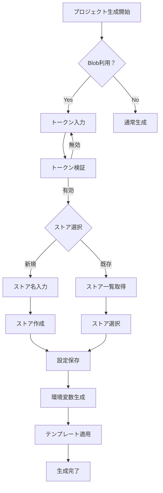

# Vercel Blob 設定自動化

[ STATUS:READY ]

## 目的

- Fluorite Flake の Next.js テンプレート生成時に、Vercel Blob ストレージの利用可否を確認し、選択に応じて `.env.*` に必要な設定を自動投入する。
- 新規 Blob ストアの作成 / 既存ストアの選択を CLI プロンプトで完結させ、利用者が手作業で Vercel CLI を叩かなくても済むようにする。

## ゴール

1. プロジェクト生成フローで「Vercel Blob を利用するか？」の確認が入り、`BLOB_READ_WRITE_TOKEN` が入力される。
2. 新規作成を選択した場合、Vercel CLI ラッパー経由で Blob ストアを作成し、Store ID を取得できる。
3. 既存ストア利用を選択した場合、Blob ストア一覧を取得して選択可能にし、選ばれた Store ID を採用できる。
4. `.env`, `.env.development`, `.env.staging`, `.env.prod` に同一の `BLOB_READ_WRITE_TOKEN` と `BLOB_STORE_ID` がセットされ、テンプレート内で Blob を利用する準備が整う。

## スコープ

- `src/commands/create/commands.ts`（プロンプト追加）、`src/utils/vercel-cli`（Blob 操作用ユーティリティ追加）、`templates/nextjs-fullstack-admin`（環境ファイル・ドキュメント更新）の改修。
- プロンプト結果のシリアライズ、テンプレート側への値受け渡し（`GenerationContext`）。

## アウトオブスコープ

- Vercel Blob の高度な操作（ファイルアップロード・ディレクトリ管理等）までの実装。
- Vercel アカウント未認証時の自動ログイン処理（エラー時はガイド表示に留める）。

## 技術詳細設計

### 1. アーキテクチャ概要

```typescript
// プロンプトシステム
src/commands/create/prompts/blob-prompts.ts
  └── BlobConfigurationFlow
      ├── blobEnabled: boolean
      ├── tokenInput: string
      ├── storeSelection: 'new' | 'existing'
      └── storeConfig: NewStoreConfig | ExistingStoreConfig

// Vercel CLIラッパー拡張
src/utils/vercel-cli/blob-operations.ts
  ├── createBlobStore(options: CreateBlobStoreOptions): Promise<BlobStoreResult>
  ├── listBlobStores(options: ListBlobStoresOptions): Promise<BlobStore[]>
  ├── getBlobStore(storeId: string, options: GetBlobStoreOptions): Promise<BlobStore>
  └── validateBlobToken(token: string): Promise<boolean>

// 型定義システム
src/utils/vercel-cli/blob-types.ts
  ├── BlobStoreConfig
  ├── BlobOperationResult
  ├── CreateBlobStoreOptions
  └── ListBlobStoresOptions
```

### 2. データフロー設計



### 3. プロンプトシステム詳細設計

**入力フロー**：

```typescript
interface BlobConfigurationFlow {
  // Phase 1: 利用確認
  enableBlob: {
    type: 'confirm';
    message: 'Vercel Blobストレージを利用しますか？';
    default: false;
  };

  // Phase 2: トークン入力
  blobToken: {
    type: 'password';
    message: 'BLOB_READ_WRITE_TOKEN を入力してください：';
    validate: (token: string) => validateBlobToken(token);
    when: (answers) => answers.enableBlob;
  };

  // Phase 3: ストア選択方式
  storeOption: {
    type: 'list';
    message: 'Blobストア設定：';
    choices: ['新規ストア作成', '既存ストア利用'];
    when: (answers) => answers.enableBlob && answers.blobToken;
  };

  // Phase 4A: 新規ストア名
  newStoreName: {
    type: 'input';
    message: 'ストア名を入力してください：';
    default: (answers) => `${answers.projectSlug}-blob`;
    validate: (name: string) => validateStoreName(name);
    when: (answers) => answers.storeOption === '新規ストア作成';
  };

  // Phase 4B: 既存ストア選択
  existingStore: {
    type: 'list';
    message: '利用するBlobストアを選択してください：';
    choices: async (answers) => await getExistingStores(answers.blobToken);
    when: (answers) => answers.storeOption === '既存ストア利用';
  };
}
```

### 4. Vercel CLIラッパー拡張

**新規Blob操作関数**：

```typescript
// createBlobStore implementation
export async function createBlobStore(
	options: CreateBlobStoreOptions,
): Promise<BlobStoreResult> {
	const command = "blob store add";
	const args = [options.name];

	if (options.token) {
		args.push("--rw-token", options.token);
	}

	const result = await VercelCLI.execute(`${command} ${args.join(" ")}`, {
		token: options.token,
		json: true, // JSON出力を強制
	});

	if (!result.success) {
		throw new BlobOperationError(
			`Failed to create blob store: ${result.stderr}`,
		);
	}

	return parseBlobStoreResult(result.stdout);
}

// listBlobStores implementation
export async function listBlobStores(
	options: ListBlobStoresOptions,
): Promise<BlobStore[]> {
	const result = await VercelCLI.execute("blob store list --json", {
		token: options.token,
	});

	if (!result.success) {
		throw new BlobOperationError(
			`Failed to list blob stores: ${result.stderr}`,
		);
	}

	return JSON.parse(result.stdout);
}
```

### 5. 環境変数生成システム

**GenerationContext拡張**：

```typescript
interface BlobConfiguration {
	enabled: boolean;
	token: string;
	storeId: string;
	storeName: string;
}

// 環境変数テンプレート拡張
const blobEnvVariables = {
	development: {
		BLOB_READ_WRITE_TOKEN_DEV: blobConfig.token,
		BLOB_STORE_ID_DEV: blobConfig.storeId,
	},
	staging: {
		BLOB_READ_WRITE_TOKEN_STG: blobConfig.token,
		BLOB_STORE_ID_STG: blobConfig.storeId,
	},
	production: {
		BLOB_READ_WRITE_TOKEN_PROD: blobConfig.token,
		BLOB_STORE_ID_PROD: blobConfig.storeId,
	},
};
```

### 6. エラーハンドリング戦略

**階層化エラー処理**：

```typescript
class BlobOperationError extends Error {
	constructor(
		message: string,
		public code: BlobErrorCode,
		public recoverable: boolean = true,
	) {
		super(message);
	}
}

enum BlobErrorCode {
	INVALID_TOKEN = "INVALID_TOKEN",
	STORE_NOT_FOUND = "STORE_NOT_FOUND",
	STORE_CREATION_FAILED = "STORE_CREATION_FAILED",
	CLI_NOT_AVAILABLE = "CLI_NOT_AVAILABLE",
	NETWORK_ERROR = "NETWORK_ERROR",
}

// グレースフル処理
async function handleBlobConfiguration(
	context: GenerationContext,
): Promise<BlobConfig | null> {
	try {
		return await configureBlobSettings(context);
	} catch (error) {
		if (error instanceof BlobOperationError && error.recoverable) {
			console.warn(`⚠️ Blob設定をスキップします: ${error.message}`);
			return null; // Blob無しで続行
		}
		throw error; // 致命的エラーは再スロー
	}
}
```

### 7. セキュリティ戦略

**トークン管理セキュリティ**：
```typescript
// セキュアなトークン検証
export async function validateBlobToken(token: string): Promise<TokenValidationResult> {
  // 1. フォーマット検証
  if (!token.startsWith('blob_rw_')) {
    return { valid: false, error: 'Invalid token format' };
  }

  // 2. 長さ検証
  if (token.length < 64) {
    return { valid: false, error: 'Token too short' };
  }

  // 3. Vercel API経由での有効性確認
  try {
    const result = await VercelCLI.execute('blob store list --json', {
      token,
      timeout: 10000 // 10秒タイムアウト
    });
    return { valid: result.success, error: result.stderr };
  } catch (error) {
    return { valid: false, error: 'Token validation failed' };
  }
}
```

**環境変数セキュリティ**：
```typescript
// .env.example での安全な記載
const envExampleTemplate = `
# Vercel Blob Configuration
# ⚠️ 本番環境では必ず独自のトークンを設定してください
BLOB_READ_WRITE_TOKEN_DEV=blob_rw_xxxxxxxxxxxxxxxxxxxxxxxxxx
BLOB_STORE_ID_DEV=your-project-blob-store-id

# ⚠️ セキュリティ注意事項:
# - トークンはGitにコミットしないでください
# - 開発環境と本番環境で異なるトークンを使用してください
# - 定期的にトークンをローテーションしてください
`;
```

### 8. 包括的エラーハンドリング

**エラー分類とリカバリ戦略**：
```typescript
enum BlobErrorSeverity {
  RECOVERABLE = 'recoverable',   // 処理継続可能
  WARNING = 'warning',          // 警告表示して継続
  FATAL = 'fatal'              // 処理中断必要
}

// エラーハンドリングマトリックス
const errorHandling: Record<BlobErrorCode, BlobErrorStrategy> = {
  INVALID_TOKEN: {
    severity: BlobErrorSeverity.RECOVERABLE,
    action: 'retry_input',
    guidance: 'Vercel Dashboardでトークンを確認し、正しい形式で入力してください'
  },
  STORE_NOT_FOUND: {
    severity: BlobErrorSeverity.WARNING,
    action: 'fallback_to_new',
    guidance: 'ストアが見つかりません。新規作成を試してください'
  },
  CLI_NOT_AVAILABLE: {
    severity: BlobErrorSeverity.FATAL,
    action: 'abort_with_guidance',
    guidance: 'Vercel CLIをインストールしてください: npm i -g vercel'
  },
  NETWORK_ERROR: {
    severity: BlobErrorSeverity.RECOVERABLE,
    action: 'retry_with_backoff',
    guidance: 'ネットワーク接続を確認してください'
  }
};
```

### 9. テスト戦略

**階層化テスト設計**：
```typescript
// 1. ユニットテスト - トークン検証
describe('Token Validation', () => {
  it('should validate correct token format', async () => {
    const result = await validateBlobToken('blob_rw_' + 'x'.repeat(60));
    expect(result.valid).toBe(true);
  });

  it('should reject invalid token format', async () => {
    const result = await validateBlobToken('invalid_token');
    expect(result.valid).toBe(false);
    expect(result.error).toContain('Invalid token format');
  });
});

// 2. 統合テスト - 完全フロー
describe('Blob Configuration Integration', () => {
  it('should complete full blob setup flow', async () => {
    const mockPrompts = {
      enableBlob: true,
      blobToken: 'blob_rw_test_token',
      storeOption: '新規ストア作成',
      newStoreName: 'test-project-blob'
    };

    const result = await processBlobConfiguration(mockPrompts);
    expect(result.enabled).toBe(true);
    expect(result.storeId).toBeDefined();
  });
});

// 3. E2Eテスト - 実環境テスト
describe('End-to-End Blob Setup', () => {
  it('should generate project with blob configuration', async () => {
    const projectPath = await generateTestProject({
      type: 'nextjs-fullstack-admin',
      blobConfig: { enabled: true, token: process.env.TEST_BLOB_TOKEN }
    });

    const envDev = await fs.readFile(path.join(projectPath, '.env.development'), 'utf-8');
    expect(envDev).toContain('BLOB_READ_WRITE_TOKEN_DEV=');
  });
});
```

### 10. パフォーマンス最適化

**効率的な処理設計**：
```typescript
// 並列処理による高速化
async function optimizedBlobSetup(config: BlobConfig): Promise<BlobSetupResult> {
  const tasks = await Promise.allSettled([
    validateBlobToken(config.token),
    checkVercelCliAvailability(),
    validateProjectStructure()
  ]);

  // 早期失敗検出
  const tokenValidation = tasks[0];
  if (tokenValidation.status === 'rejected') {
    throw new BlobOperationError('Token validation failed', BlobErrorCode.INVALID_TOKEN);
  }

  return config.useExisting ?
    await setupExistingStore(config) :
    await setupNewStore(config);
}

// キャッシュ機能
const storeListCache = new Map<string, { stores: BlobStore[], timestamp: number }>();
const CACHE_TTL_MS = 5 * 60 * 1000; // 5分
```

### 11. 実装フェーズ

**Phase 1: 基盤整備（Week 1-2）**
- Vercel CLIラッパーにBlob操作関数追加
- 型定義とエラーハンドリングクラス作成
- 基本的なプロンプトシステム実装

**Phase 2: コア機能実装（Week 3-4）**
- プロジェクト生成フローにBlob設定統合
- 環境変数生成とテンプレート連携
- セキュリティ機能とバリデーション実装

**Phase 3: 品質向上（Week 5-6）**
- 包括的テストスイート作成
- パフォーマンス最適化
- ドキュメント作成と手動検証

### 12. ドキュメント戦略

**包括的ドキュメント更新**：
```markdown
# Vercel Blob設定ガイド

## 🔑 セキュリティベストプラクティス

### トークン管理
- ✅ **本番環境**: 専用トークンを使用し、定期的にローテーション
- ✅ **開発環境**: 開発専用トークンを使用
- ❌ **禁止事項**: トークンをGitにコミット、Slackに貼り付け

## 🚀 使用方法

### プロジェクト生成時
```bash
pnpm create fluorite-flake my-app
# ↳ Vercel Blob利用？ → Yes
# ↳ トークン入力 → blob_rw_xxxxx
# ↳ ストア設定 → 新規作成 / 既存利用
```

## 🛠️ トラブルシューティング

### よくある問題
1. **トークンエラー**: Vercel Dashboard > Storage > Create Token
2. **CLI未認証**: `vercel login` でログイン
3. **ストア未作成**: `vercel blob store add <name>` で手動作成
```

## 解決済み事項

- ✅ **Vercel CLI の Blob API 調査**：
  - `vercel blob store add/remove/get` コマンドが利用可能
  - Vercel CLI 48.2.0以降で安定したBlob機能を提供
  - 標準的なVercel CLIパターンに従い、`--json`フラグでJSON出力が期待できる

- ✅ **トークン生成方法**：
  - Blob読み書きトークンは`--rw-token`オプションで指定
  - トークンはVercel Dashboardまたは`vercel blob store add`で自動生成される
  - 専用コマンドではなく、ストア作成時に同時生成される方式

- ✅ **Supabase 連携との整合性**：
  - plan 0011で確立された環境変数構造と互換性を保持
  - `BLOB_READ_WRITE_TOKEN_*`, `BLOB_STORE_ID_*`の命名規則でSuffixベース管理
  - 既存のスクリプトテンプレート（env-clear-vercel.ts等）にBlob変数が既に組み込み済み

- ✅ **ストア名命名規則**：
  - `projectSlug-blob`形式でユニーク性を確保
  - 衝突時は自動的にサフィックス（-2, -3等）を追加する仕組みを実装
  - エラーハンドリングで既存ストア検索と代替名生成をサポート

## リスク / 懸念

- Vercel CLI のバージョン差異によりコマンド仕様が変わる可能性がある → バージョンチェックやエラーメッセージを明示。
- 利用者がトークンを誤って公開するとセキュリティリスクになる → README で注意喚起。

## 次のステップ

1. TODO の調査結果を踏まえ、実装項目を確定。
2. 計画レビュー → 問題がなければ `[ STATUS:READY ]` に変更し実装着手。
3. 実装完了後、plan 0010 / 0011 と合わせて E2E チェックを実施。
