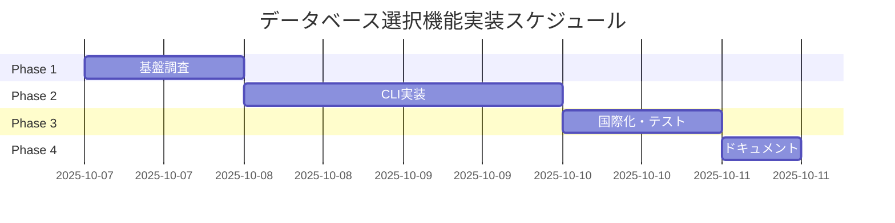

# Next.js テンプレート生成時のデータベース選択機能

[ STATUS: DONE ]

## 概要

Next.js テンプレート生成時にユーザーがデータベースを選択できる機能を追加します。選択肢は `None`、`Turso`、`Supabase` の3つで、それぞれに適した設定ファイル・依存関係・初期コードを自動生成します。

### データベース選択プロンプト (仮)

```
◆ 使用するデータベースを選択してください:
│ ● None - データベースを使用しない
│ ○ Turso - エッジで高速なSQLiteクラウドデータベース
│ ○ Supabase - オープンソースPostgreSQLベースのバックエンド
```

**重要**: `None` 選択時はデータベース関連の依存パッケージや設定ファイルを一切含めません。

## 背景と課題

現在の `fluorite create` コマンドでは、Next.js テンプレート生成時にデータベースの選択ができません。これにより以下の問題が発生しています：

- **手動設定の負担**: ユーザーが後からデータベース設定を追加する必要がある
- **初期導入の障壁**: Turso や Supabase の環境変数や SDK 設定を自分で調べて実装する必要がある
- **不要な依存関係**: データベースを使わないプロジェクトでも関連パッケージが含まれる可能性
- **一貫性の欠如**: プロジェクトごとにデータベース設定の品質や構造が異なる

## 達成目標

### 主要目標

1. **直感的な選択体験**: CLI でデータベース種別を選択でき、デフォルトは `None`
2. **自動設定生成**: 選択に応じて `package.json`、`.env.example`、初期コードを適切に生成
3. **ガイド付き初期化**: Turso/Supabase 選択時は接続確認サンプルと設定手順を提供
4. **品質保証**: 全選択肢でテストカバレッジを確保し、CI で継続検証
5. **国際化対応**: 英語・日本語のメッセージを完備

### 非機能要件

- 既存のテンプレート生成時間への影響を最小限に抑制
- コードの保守性を維持し、新しいデータベース追加を容易にする拡張性
- エラーハンドリングとユーザビリティの向上

## 成果物

### コード成果物

- **CLI 実装**: `src/commands/create/` 配下でデータベース選択ロジックを実装
- **テンプレート拡張**: 各データベース用の設定ファイルとサンプルコード
- **ユーティリティ**: `src/utils/template-manager/` でテンプレート差分適用機能
- **国際化**: `src/i18n/` の英語・日本語メッセージ辞書更新

### ドキュメント成果物

- **実装報告書**: `docs/implement-reports/0009.md`
- **ユーザーガイド**: README.md のデータベース選択セクション
- **API仕様**: 新規 CLI オプション `--database` の仕様書

### テスト成果物

- **ユニットテスト**: プロンプト・バリデーション・テンプレート適用のテスト
- **統合テスト**: 実際のプロジェクト生成と成果物検証
- **スナップショットテスト**: 生成されるファイル構造の回帰テスト

## 対応範囲

### 含む範囲

- Next.js テンプレート生成パスでのデータベース選択機能
- 最小限の接続コードと依存関係の自動追加
- 環境変数テンプレートと初期化ガイドの提供
- CLI オプション `--database` による非対話モード対応

### 含まない範囲

- データベースのプロビジョニングや実際のテーブル作成
- Turso/Supabase CLI の認証・初期化自動実行
- ORM やクエリビルダーの設定（Prisma、Drizzle等）
- 本格的なデータベーススキーマやマイグレーション機能

## 技術仕様

### CLI 仕様

```bash
# 対話モード
fluorite create my-app
# フレームワーク選択後、Next.js が選ばれた場合のみデータベース選択プロンプトを表示

# 非対話モード
fluorite create my-app --framework=nextjs --database=none
fluorite create my-app --framework=nextjs --database=turso
fluorite create my-app --framework=nextjs --database=supabase
```

### プロンプト仕様

- **表示条件**: フレームワークで Next.js が選択された場合のみ
- **デフォルト値**: `none`
- **バリデーション**: 無効な値の場合は選択肢を i18n メッセージで提示してエラー
- **メッセージキー**: `database.select.prompt`、`database.select.none` 等

### テンプレート生成仕様

#### None 選択時

```
project/
├── package.json          # DB関連依存なし
├── .env.example          # DB設定なし
└── src/app/
    └── api/
        └── hello/
            └── route.ts  # 基本的なAPI例
```

#### Turso 選択時

```
project/
├── package.json          # + @turso/database, dotenv
├── .env.example          # + TURSO_DATABASE_URL等
├── lib/
│   └── db/
│       └── turso.ts     # Tursoクライアント初期化
└── src/app/
    └── api/
        ├── hello/
        │   └── route.ts
        └── db-health/
            └── route.ts  # Turso接続確認API
```

#### Supabase 選択時

```
project/
├── package.json          # + @supabase/supabase-js
├── .env.example          # + SUPABASE_URL, SUPABASE_ANON_KEY
├── lib/
│   └── db/
│       └── supabase.ts  # Supabaseクライアント初期化
└── src/app/
    └── api/
        ├── hello/
        │   └── route.ts
        └── db-health/
            └── route.ts  # Supabase接続確認API
```

## 実装計画

### Phase 1: 基盤調査と設計 (1日)

- [ ] 現行 `src/commands/create/` の構造と Next.js テンプレート処理フローを分析
- [ ] `src/utils/template-manager/` の既存機能を確認し、DB別テンプレート差分適用方法を設計
- [ ] `package.json` 依存関係追加のユーティリティ関数を調査・設計

### Phase 2: コア機能実装 (2日)

- [ ] **CLI プロンプト追加**
  - `src/commands/create/` でデータベース選択プロンプトを実装
  - `--database` オプション追加とバリデーション
  - プロンプト表示条件（Next.js選択時のみ）を実装
- [ ] **テンプレート管理機能**
  - `templates/nextjs-fullstack-admin/` の DB別設定ファイル追加
  - 条件的ファイルコピー機能の実装
  - `package.json` 依存関係動的追加ユーティリティ

- [ ] **DB別初期化コード**
  - Turso クライアント初期化 (`lib/db/turso.ts`)
  - Supabase クライアント初期化 (`lib/db/supabase.ts`)
  - 各DB用 API Route サンプル (`app/api/db-health/route.ts`)

### Phase 3: 国際化とテスト (1日)

- [ ] **i18n メッセージ追加**
  - `src/i18n/ja.json` にプロンプトとエラーメッセージ追加
  - `src/i18n/en.json` で英語版メッセージ整備
  - メッセージキー命名規則の統一

- [ ] **テスト実装**
  - ユニットテスト: プロンプト生成、オプション解析、バリデーション
  - 統合テスト: 各DB選択でのプロジェクト生成と成果物検証
  - スナップショットテスト: 生成ファイル構造の回帰防止

### Phase 4: ドキュメントと品質確認 (0.5日)

- [ ] **ドキュメント更新**
  - README.md にデータベース選択機能の説明追加
  - 各DB設定手順とリファレンスリンクを記載
- [ ] **品質確認**
  - `pnpm lint` / `pnpm format` で静的解析通過
  - `pnpm build` で型検証通過
  - `pnpm test` で全テストケース成功

## 品質保証計画

### テスト戦略

- **ユニットテスト**: 個別機能の動作確認
  - データベース選択プロンプトの表示ロジック
  - CLI オプションのバリデーション処理
  - テンプレート差分適用ユーティリティ
- **統合テスト**: エンドツーエンドの動作確認
  - 各データベース選択での完全なプロジェクト生成
  - 生成された `package.json` の依存関係検証
  - `.env.example` とサンプルコードの内容確認
- **回帰テスト**: 既存機能への影響確認
  - 従来の Next.js テンプレート生成（`none` 選択時）の動作
  - 他フレームワーク選択時の動作に影響がないこと

### パフォーマンス要件

- テンプレート生成時間の増加を 20% 以内に抑制
- メモリ使用量の大幅な増加を避ける
- ファイルコピー処理の最適化

### エラーハンドリング

- 不正な `--database` 値の適切なエラーメッセージ表示
- テンプレートファイル不足時のフォールバック処理
- ネットワークエラー等での graceful degradation

## リスクと対策

### 技術的リスク

| リスク                                     | 影響度 | 対策                                                          |
| ------------------------------------------ | ------ | ------------------------------------------------------------- |
| 依存関係の増加によるパッケージサイズ肥大化 | 中     | `None` 選択時は一切追加せず、動的追加に限定                   |
| テンプレート分岐の複雑化                   | 高     | template-manager ユーティリティで抽象化、DB別ディレクトリ分離 |
| CI 実行時間の増加                          | 低     | ファイル検証ベースのテストで時間を抑制                        |
| 翻訳品質とメッセージ漏れ                   | 中     | テストでメッセージキー存在確認、レビューでの確認              |

### 運用リスク

| リスク                         | 影響度 | 対策                                                   |
| ------------------------------ | ------ | ------------------------------------------------------ |
| Turso/Supabase API の仕様変更  | 中     | 最小限の接続コードのみ提供、詳細は公式ドキュメント参照 |
| 新しいデータベース追加要求     | 低     | 拡張可能な設計で対応、プラグイン化の検討               |
| ユーザーからの設定関連質問増加 | 中     | 充実したドキュメントとトラブルシューティングガイド     |

## スケジュール



**総工数**: 4.5日

## 将来拡張の検討

### 追加データベース候補

- **PlanetScale**: MySQL互換の分散データベース
- **Neon**: PostgreSQL互換のサーバーレスデータベース
- **D1**: Cloudflare の SQLite ベースデータベース
- **MongoDB Atlas**: NoSQL ドキュメントデータベース

### 拡張性のための設計原則

- データベース種別の設定を JSON または設定ファイルで外部化
- プラグイン形式でのデータベース追加機能
- テンプレート生成ロジックの抽象化と再利用性

### ORM/クエリビルダー統合

- Prisma、Drizzle、Kysely 等の人気 ORM との統合オプション
- スキーマファイルやマイグレーション設定の自動生成
- 型安全性を重視した開発体験の提供

## 完了条件

### 機能要件

- [ ] `fluorite create` で Next.js 選択時にデータベース選択プロンプトが表示される
- [ ] `--database` オプションで非対話モードに対応し、無効値でエラーになる
- [ ] `none`/`turso`/`supabase` 各選択で期待する依存関係・設定・サンプルコードが生成される
- [ ] 英語・日本語の i18n メッセージが適切に表示される

### 品質要件

- [ ] 全ユニットテスト・統合テストが成功する
- [ ] `pnpm build`、`pnpm lint`、`pnpm format` が成功する
- [ ] CI/CD パイプラインで回帰テストが通過する
- [ ] コードカバレッジが既定の基準を満たす

### ドキュメント要件

- [ ] README.md にデータベース選択機能の説明が追加される
- [ ] 各データベースの設定手順と参考リンクが記載される
- [ ] `docs/implement-reports/0009.md` で実装詳細が報告される
- [ ] トラブルシューティングガイドが整備される

### ユーザビリティ要件

- [ ] 初回ユーザーが迷わずにデータベースを選択・設定できる
- [ ] エラーメッセージが分かりやすく、解決方法が明示される
- [ ] 生成されたプロジェクトで即座に開発を開始できる
