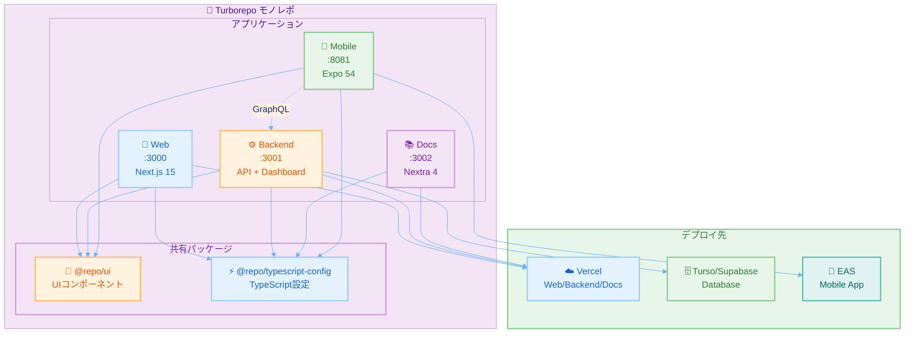
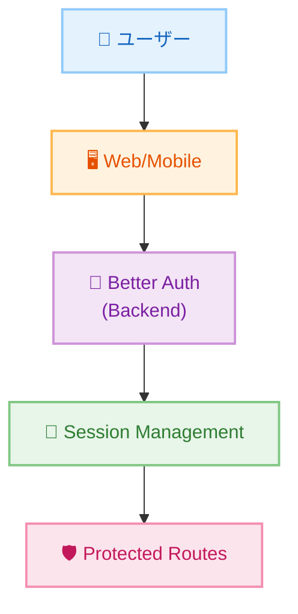
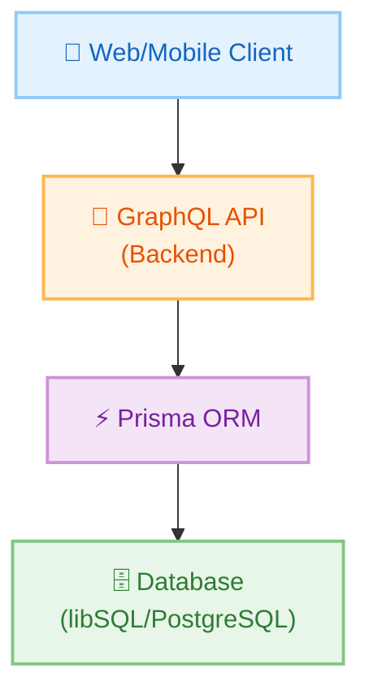
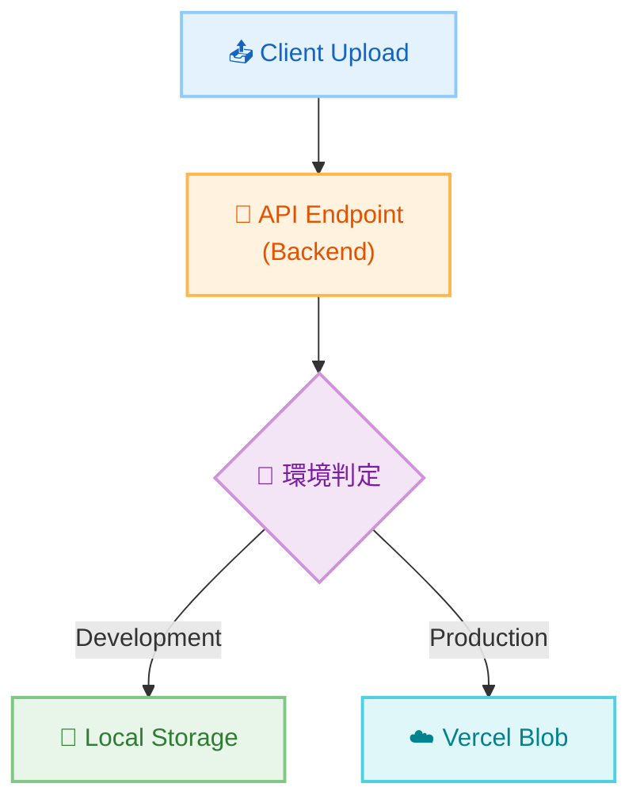

# アーキテクチャ概要

このプロジェクトは、モダンなフルスタック Turborepo モノレポとして設計されています。

## 🏗️ 全体アーキテクチャ

## 📦 モノレポ構成

### Apps（アプリケーション）

| アプリ | ポート | 説明 | 技術スタック |
|--------|--------|------|--------------|
| **web** | 3000 | マーケティングサイト・フロントエンド | Next.js 15, React 19 |
| **backend** | 3001 | 管理ダッシュボード + API サーバー | Next.js 15, Apollo Server, Prisma |
| **docs** | 3002 | ドキュメントサイト | Next.js 15, Nextra 4 |
| **mobile** | 8081 | モバイルアプリ | Expo 54, React Native |

### Packages（共有パッケージ）

| パッケージ | 説明 | 使用者 |
|-----------|------|--------|
| **@repo/ui** | 共有 UI コンポーネントライブラリ | web, backend, mobile |
| **@repo/typescript-config** | 共通 TypeScript 設定 | 全アプリ |

## 🎯 設計思想

### 1. モノレポによる統合管理

**利点**:
- コードの再利用性向上
- 一貫した開発環境
- 依存関係の一元管理
- 効率的なビルドとキャッシング

### 2. 型安全性の徹底

**実現方法**:
- TypeScript による完全な型定義
- Prisma による型安全なデータベースアクセス
- GraphQL による型安全な API 通信
- Zod によるランタイムバリデーション

### 3. 開発者体験の最適化

**特徴**:
- ホットリロード対応
- 高速なビルド（Turbopack）
- 自動型生成
- 統一されたツールチェイン

## 🔄 データフロー

### 認証フロー

### API通信フロー

### ファイルストレージフロー

## 🛡️ セキュリティ層

### 認証・認可

- Better Auth によるセッション管理
- JWT トークンによる API 認証
- ロールベースアクセス制御（RBAC）

### データ保護

- 環境変数による機密情報管理
- データベース接続の暗号化
- HTTPS 通信の強制

## 📊 スケーラビリティ

### 水平スケーリング

- Vercel の自動スケーリング
- CDN によるグローバル配信
- エッジロケーションの活用

### パフォーマンス最適化

- Turborepo キャッシング
- 増分ビルド
- 静的生成とサーバーサイドレンダリングの使い分け

## 🧩 依存関係管理

### パッケージマネージャー

**pnpm の採用理由**:
- ディスクスペースの効率化
- 高速なインストール
- Workspace 対応

### バージョン管理

- 各アプリは独立したバージョン
- 共有パッケージは Workspace プロトコル
- 自動的な依存関係解決

## 🔧 ビルドシステム

### Turborepo

**特徴**:
- 並列ビルド実行
- インテリジェントキャッシング
- 依存関係グラフの自動解決

**主要タスク**:
- `dev`: 開発サーバー起動
- `build`: プロダクションビルド
- `test`: テスト実行
- `lint`: Lint チェック

## 📚 関連ドキュメント

- **[Backend アーキテクチャ](/architecture/backend)** - API とデータベース設計
- **[Web アーキテクチャ](/architecture/web)** - フロントエンド設計
- **[Mobile アーキテクチャ](/architecture/mobile)** - モバイルアプリ設計
- **[Database アーキテクチャ](/architecture/database)** - データベース設計
- **[認証フロー](/architecture/authentication)** - 認証システム設計
